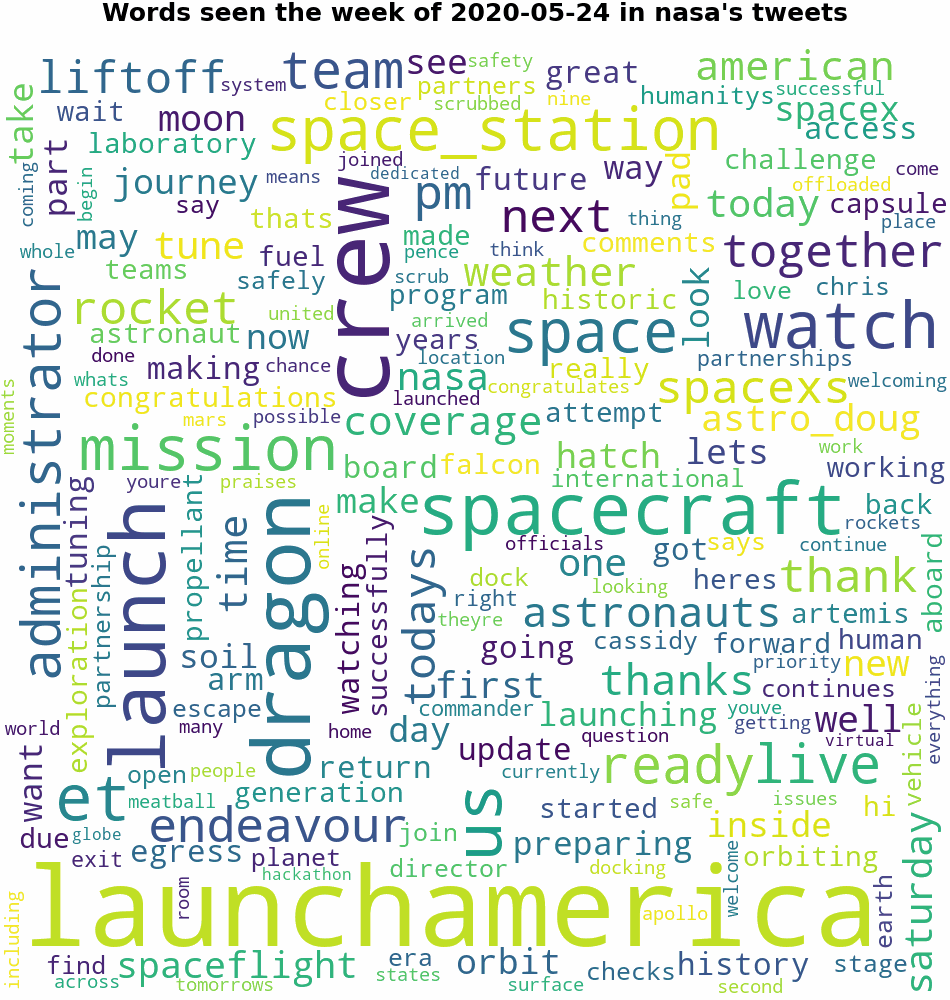

# Welcome to TweetCloud!

The goal of this project is generate a gif of word clouds from a specific Twitter user's tweets. Currently, 3000 is the max number of tweets that will be fetched from Twitter.

**NOTE**: This project is in development, so not all features will work or are finished! Feel free to open a PR if you'd like to contribute!

## Setup

1. [Create a Twitter app](https://developer.twitter.com/en/apps)
1. Add the following keys from your new Twitter app to your environment variables
   - `export TWTR_CONS_KEY=<TWITTER_CONSUMER_API_KEY>`
   - `export TWTR_CONS_SEC=<TWITTER_CONSUMER_API_SECRET_KEY>`
   - `export TWTR_ACC_KEY=<TWITTER_ACCESS_TOKEN>`
   - `export TWTR_ACC_SEC=<TWITTER_TOKEN_SECRET>`

## How to use

`python3 app.py <screen_name> <number_of_tweets>`

### Example

Running `python3 app.py nasa 1000` generates:

## Contributors

- [jgoldfinger](https://github.com/jgoldfinger)
